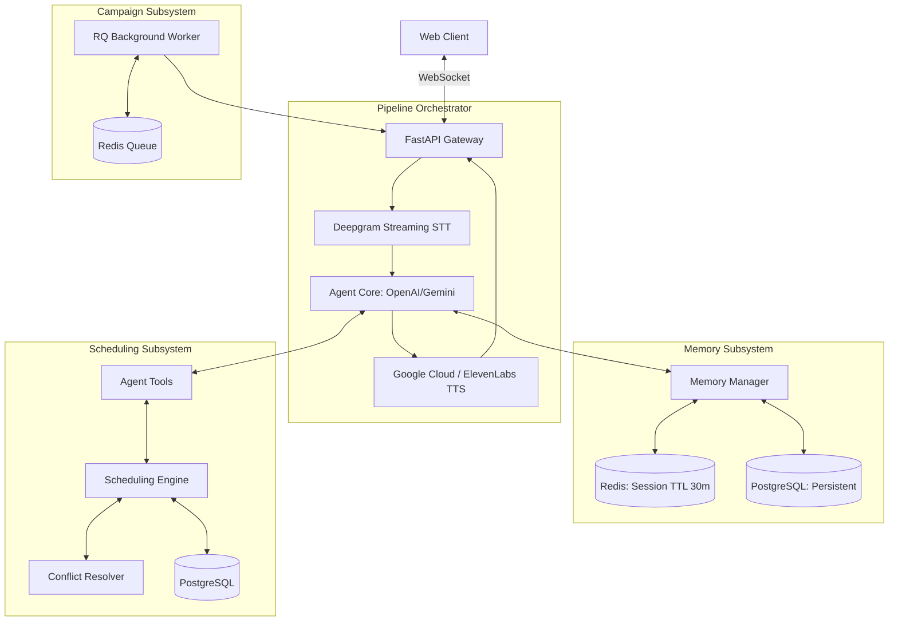

# System Architecture

The Real-Time Multilingual Voice AI Agent is designed for single-turn, low-latency conversational AI with strict guarantees on appointment scheduling. 

## High-Level Pipeline

## Data Flow Optimization

The fundamental challenge in Voice AI is latency. This architecture optimizes the data flow through **Pipeline Overlapping**:

1. **VAD Triggering:** STT streams audio continuously. When Voice Activity Detection (VAD) detects silence, an interim transcript is finalized to an utterance.
2. **Parallel Memory Fetch:** Before the LLM is invoked, the `MemoryManager` fetches the patient's context from PostgreSQL and the active session state from Redis. This happens concurrently with STT transcript finalization.
3. **LLM Tool Loop:** The `VoiceAgent` processes the context. If an intent to book is detected, the LLM emits a tool call prior to generating speech text. The tool executes synchronously with a DB lock.
4. **Chunked TTS Delivery:** The LLM streams its response back to the orchestrator. As soon as a logical sentence or clause is complete, it is shipped to the TTS engine. The TTS engine responds with the first audio chunk, which is immediately flushed down the WebSocket to the client while the LLM continues generating the rest of the text.

## Component Responsibilities

1. **FastAPI (main.py)**: Manages WebSocket connection lifecycle, routes raw PCM 16kHz audio to the orchestrator, and provides REST APIs for campaigns.
2. **Orchestrator (orchestrator.py)**: Wires STT, Agent, and TTS together. Detects Barge-in (cancellation of TTS output when the user speaks).
3. **Agent Core (core.py, tools.py)**: Executes the system prompt injects real-time tools natively (OpenAI Function Calling format) to interact with the scheduling engine.
4. **Scheduling Engine (engine.py)**: Contains the vital business logic for booking, enforcing row-level database locks to guarantee zero double-bookings.
